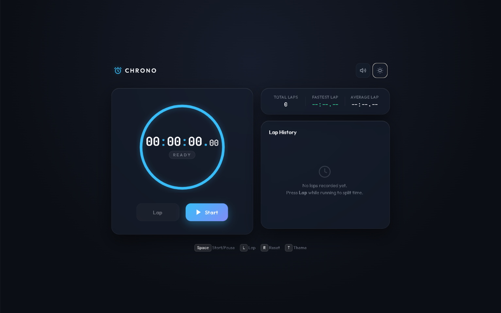

# ⏱️ Chrono – Precision Stopwatch Timer

A modern, responsive, and user-friendly stopwatch web application built using **HTML, CSS, and JavaScript**.

Chrono provides accurate time tracking with lap recording, fastest lap, average lap statistics, keyboard shortcuts, sound controls, and theme switching.

---

## 🚀 Features

- ▶️ Start / Pause Stopwatch
- 🔄 Reset Stopwatch
- 🏁 Record Lap Times
- 📊 Total Laps Counter
- ⚡ Fastest Lap Tracking
- 📈 Average Lap Time
- 📜 Lap History
- ⌨️ Keyboard Shortcuts
- 🔊 Sound Toggle
- 🌙 Dark / Light Theme
- 📱 Responsive Design
- ⚡ Real-time Timer Display

---

## ⌨️ Keyboard Shortcuts

| Key | Action |
|-----|--------|
| `Space` | Start / Pause |
| `L` | Record Lap |
| `R` | Reset |
| `T` | Toggle Theme |

---

## 🛠️ Technologies Used

- **HTML5** – Website structure
- **CSS3** – Styling, layout and responsive design
- **JavaScript** – Stopwatch logic and user interactions
- **DOM Manipulation** – Dynamic UI updates
- **JavaScript Event Listeners** – Button and keyboard controls

---

## 📸 Screenshot



---

## 🎯 Project Highlights

This project helped me practice and implement:

- JavaScript timers
- DOM manipulation
- Event handling
- Keyboard events
- Arrays and data handling
- Dynamic UI updates
- Responsive web design
- Theme switching
- Lap time calculations

---

## 💻 How to Run Locally

 Clone the repository:

```bash
git clone https://github.com/YOUR-USERNAME/chrono-stopwatch.git

📁 Project Structure
chrono-stopwatch/
│
├── index.html
├── style.css
├── script.js
├── README.md
│
└── assets/
    └── screenshot.png

👨‍💻 Author
Satyam Kumar Kewot

⭐ Support

If you found this project useful or interesting, consider giving the repository a ⭐.

Built with ❤️ using HTML, CSS & JavaScript.


